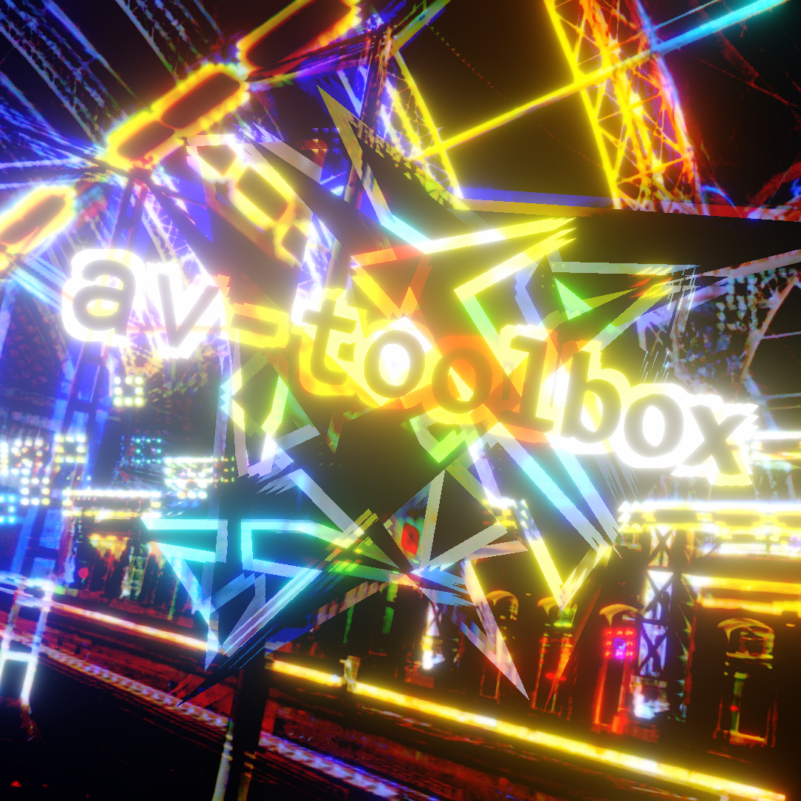

# AudioVisual Toolbox

**Consider to support by buying patches via http://gumroad.com/tmhglnd**

**or become a patron on http://patreon.com/timohoogland**

Suggestions, bug reports and feature requests are much appreciated. Please add them to the issues.

---

## About

This package contains small abstractions to assist you in creating realtime audiovisual works. Objects range from signal analysis that can be used to control visual parameters, objects that allow controlling events in time with transport, objects that extend/wrap some jitter objects, some object mappings to initialize jitter objects with common used attributes and more.



## Contains


### Signal analysis

- **av.amp~** - A simple envelope follower for audioreactive visuals.

- **av.follow~** - A more sophisticated envelope follower with low and highpass cutoff and a fast and slow follower to detect transients better and filter out low frequency information.

- **av.follow3~** - Split a signal into low, mid and high frequency bands and apply an envelope follower.

- **av.trigger~** - An envelope follower (using av.follow~) that outputs a bang and gate signal based on a set upper and lower threshold.

- **av.catch~** - Catch amplitudes of 3 different signals in time and output as 3-plane matrix. Generates a 3-dimensional oscilloscope (X Y Z).

- **av.spectrum~** - Grab an FFT frame (spectrum) from an incoming signal and output as a one-dimensional jitter matrix.

- **av.spectrogram~** - Grab a history of successive FFT frames (spectrum) from an incoming signal and output as a 2-dimensional jitter matrix.

- **av.midside~** - Split a stereo signal into mid (R+L) and side (R-L, L-R) information.

- **av.cross3~** - Split a signal into low, mid and high frequency bands, with adjustable cross-over frequencies.

### Timeline control

- **av.when** - Combine with (named) `[transport]`. Displays the current time in `min:sec:ms`.

- **av.timepoint** - Combine with (named) `[transport]`. Outputs a bang at a specified timepoint in `min:sec:ms`.

- **av.timetrigger~** - Combine with (named) `[transport]`. Outputs a regular stream of bangs at a specified interval in `min:sec:ms`.

- **av.timetoticks** - Combine with (named) `[transport]`. Convert `min:sec:ms` to relative ticks.

- **av.phasor~** - Combine with (named) `[transport]`. A phasor locked to transport where the time-interval can be set in `min:sec:ms`.

- **av.function** - Initialize a `[function]` object with settings: `[function @pointsize 4 @gridstep_x 0.1 @linethickness 2 @clicksustain 0 @legend 0 @grid 3 @domain 1 @mode 1 @outputmode 1]`.

- **av.automation~** - A `[function]` wrapped in a bpatcher with zoom functionality and controlled by an av.phasor~ synced to global transport.

- **av.speedgate** - Cancel the throughput of bangs/messages for a specified amount of time.

- **av.chance** - Pass a bang from the inlet to the outlet with a specified probability in percentage (0-100).

- **av.loadmess** - A loadmess that fires the message after all loadmess/loadbang objects and patcherargs in abstractions.

### Jitter extensions

- **av.movie~** - The jit.movie~ object with extras. Loads begin and end of the movie in the RAM for seamless looping.

- **av.movieplay~** - The jit.movie object that can be controlled with an audio signal similar to the play~ object. Combine movieplay~ with play~ for audiorate playback of sound together with movie.

- **av.sync~** - A short burst of noise combined with a white flash on a videoplane. Useful to synchronize a separate visuals and sound recording when editting.

- **av.testpattern** - Display a testpattern image on a layer. Useful during mapping of a projector.

- **av.paramgenerator** - Generate flonum boxes combined with a pak object to control parameters in `jit.gl.slab` objects on shift+option+click.

- **av.enable** - Enable/disable the processing of a slab or pix object with a toggle and also output either processed or incoming texture.

- **av.enable.xfade** - Enable/disable the processing of a slab or pix object with a float `0 - 1` and cross-fade between the images.

- **av.screenshot** - Use a bang to take a screenshot of the incoming jitter texture.

- **av.camera.control** - Control a camera position and panning with the keyboard and mouse. Use `asdw` for position and `jkli` or `mouse` for panning/lookat. Position and rotation are exposed to pattrstorage preset system to easily store positions.

### Jitter Mappings

- **av.world** - The rendering context. Initialize a `[jit.world @erase_color 0 0 0 1 @fsaa 1 @floating 1 @size 640 360 @windowposition 800 200 @fps 60 @output_texture 1 @dim 1920 1080]`.

- **av.node** - A rendering node. Initialize a `[jit.gl.node @capture 1 @adapt 0 @dim 1920 1080 @erase_color 0 0 0 0 @fsaa 1]`

- **av.videoplane** - Display a video/texture. Initialize `[jit.gl.videoplane @transform_reset 2 @blend add @blend_enable 1 @depth_enable 0 @layer 1000]`

- **av.cornerpin** - Map a video/texture. Initialize `[jit.gl.cornerpin @corner_radius 50 @line_width 4 @corner_color 1 0 0 1 @drawcorners 1]`

- **av.camera** - Position a camera. Initialize a `[jit.gl.camera @position 0 0 4 @locklook 1 @lookat 0 0 0 @tripod 1 @lens_angle 45]`

- **av.camera.drive** - Connec to a camera to control with keyboard and mouse. Initialize a `[jit.anim.drive @ui_listen 1 @ease 0.5 @speed 5]`

- **av.movie** - Load and play a moviefile or image. Initialize a `[jit.movie @output_texture 1 @vol 0 @autostart 0 @engine viddll @cache_size 0.5]`

- **av.gridshape** - Show a shape (sphere, cube, plane, etc). Initialize a `[jit.gl.gridshape @shape sphere @scale 0.5 @color 1 1 1 1 @smooth_shading 1 @lighting_enable 1 @dim 50 50 @matrixoutput 0]`

- **av.mesh.points** - Display points from a matrix. Initialize a `[jit.gl.mesh @draw_mode points @point_mode circle_depth @point_size 10 @color 1 1 1 1 @lighting_enable 1]`

- **av.mesh.grid** - Draw connected points as a grid. Initialize a `[jit.gl.mesh @draw_mode quad_grid @poly_mode 1 1 @line_width 1 @lighting_enable 1]`

### Utilities

- **av.hidecursor** - Hides the cursor when inactive for a specified amount of time.

### Slab/Shader/Pix Mappings

This package includes mappings for the `jit.gl.slab`, `jit.gl.shader` and `jit.gl.pix` object based on the project [gl.shadermappings](https://github.com/tmhglnd/gl.shadermappings). 

Max has quite a few shaders build into the application and examples. But if you want to patch with them you have to type `jit.gl.slab @file <shaderfile>`, which is usually quite a hassle. Also you have to remember what the shader file name is. These simple objectmappings file will do all this work for you and allow you to browse the various files through the autocomplete field. How it works:

1. See all the shaderfiles in the autocomplete field when typing `jit.gl.slab.*`, `jit.gl.shader.*` or `jit.gl.pix.*`
2. Select the shaderfile and it will translate to `jit.gl.slab @file <shaderfile>`

## Install

```
1. download zip
2. unzip and place in Max Packages (on MacOS ~/Documents/Max 8/Packages)
3. restart Max8, open Package manager, Launch av-toolbox
```

```
1. open terminal
2. navigate to Max Packages (on MacOS cd ~/Documents/Max\ 8/Packages)
3. $ git clone https://github.com/tmhglnd/av-toolbox.git
4. restart Max8, open Package manager, Launch av-toolbox
```

## To Do / Ideas

- [ ] **av.param~** - Control parameters of shaders with signals and include smoothing/easing

- [ ] **av.line** - A ramp-generator with range and easing to control a parameter

- [ ] Help-files for: av.automation~

- [ ] Documentation for: av.when, av.trigger~, av.timetrigger~, av.timetoticks, av.timepoint, av.testpattern, av.sync~, av.automation~